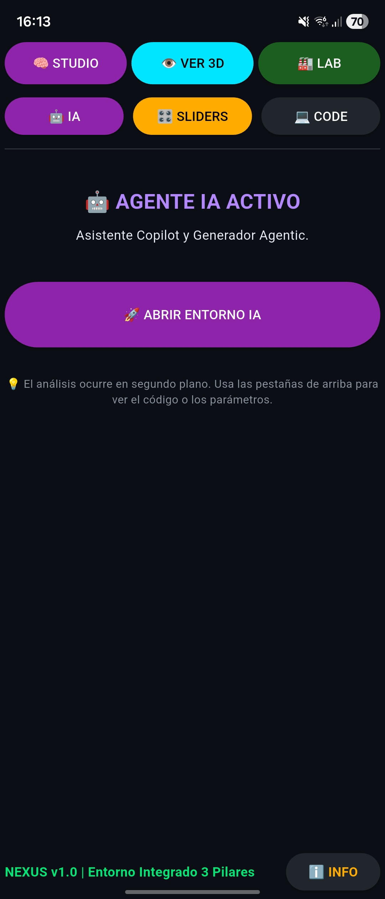
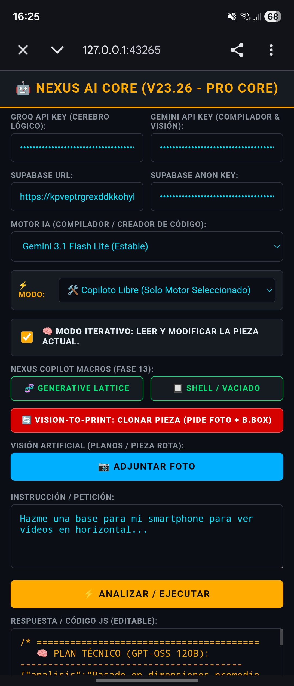
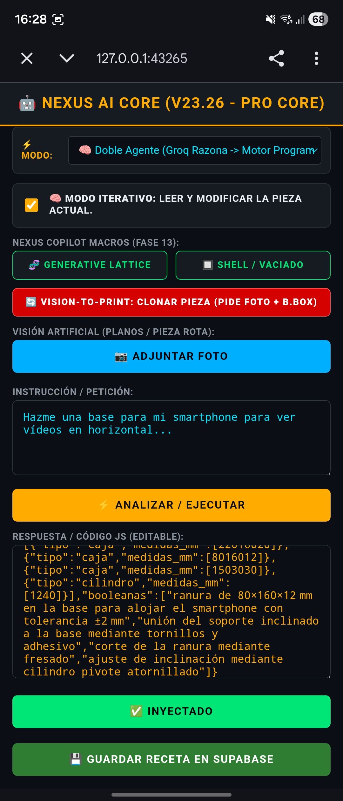
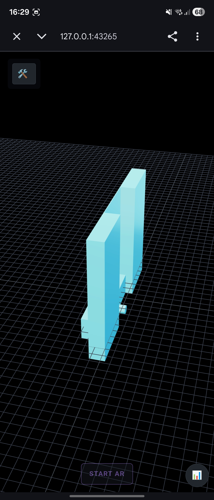
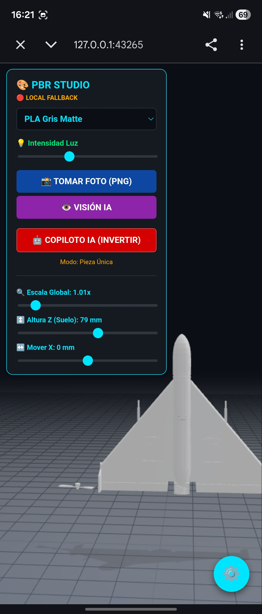
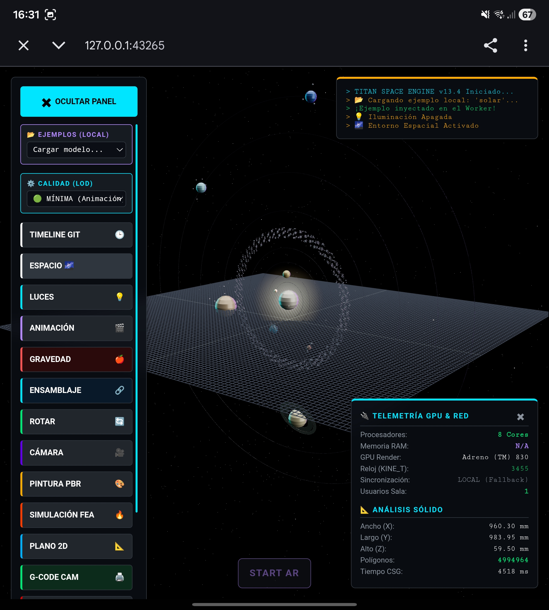

# 🌌 NEXUS CAD TITAN PRO & AI CORE (v21.2)


<p align="center">
  
</p>

NEXUS CAD TITAN PRO es un ecosistema completo de diseño 3D paramétrico, edición avanzada de archivos STL, renderizado físico (PBR) y asistencia por Inteligencia Artificial (Doble Agente), diseñado para ejecutarse de forma nativa en dispositivos móviles (vía Termux/Android) y PC.

La interfaz está diseñada bajo una **Arquitectura de 3 Pilares** (`🧠 STUDIO`, `👁️ VER 3D` y `🏭 LAB`), permitiendo un flujo de trabajo sin fricciones desde la idea inicial hasta la configuración para impresión 3D.

---

## ✨ ¿Qué hace la aplicación? (Arquitectura 3 Pilares)

### 🧠 PILAR 1: STUDIO (Creación y AI Core)

<p align="center">
  
  
  
</p>

* **🤖 Nexus AI Core v23.26 (Doble Agente):** Integración con LLMs (Gemini 3.1 Flash Lite y Groq GPT-OSS 120B). Un agente "Arquitecto" estructura JSON técnicos, y un "Compilador" los traduce a código `CSG.js` con un puente de auto-reparación de errores (Anti-Z-Fighting y Anti-Flip).
* **👁️ Vision-to-Print (Ingeniería Inversa):** Sube una foto de una pieza rota o un plano, y la IA deducirá las instrucciones paramétricas para clonarla limitándola a un Bounding Box exacto.
* **🧬 Macros Generativas:** Aplica funciones complejas con un clic como *Generative Lattice* (Optimización topológica) o Vaciados (*Shell*).
* **🎛️ Generadores Paramétricos (Sliders):** Módulos pre-programados listos para usar: Engranajes (Evolvente, Cónico, Planetario), cajas multicuerpo, perfiles NACA, drones, planetarios cinemáticos y mucho más.
* **💻 Motor de Código JS-CSG:** Modelado 3D paramétrico impulsado por *Constructive Solid Geometry*.
* **🔥 Sistema Hot Reload:** Recarga en caliente del código base (`importlib`) que permite diseñar nuevas herramientas paramétricas sin reiniciar la app.

### 👁️ PILAR 2: VER 3D (Titan Space Engine)

<p align="center">
  
</p>

* **🚀 WebWorkers Asíncronos:** Las operaciones booleanas complejas se calculan en hilos secundarios para no congelar la UI jamás, permitiendo un renderizado asíncrono ultra-rápido.
* **🌐 Visor Externo y LAN:** Enrutamiento HTTP automático para visualizar tu diseño 3D en tiempo real desde cualquier monitor o PC conectado a la misma red WiFi.
* **🎨 PBR Studio PRO:** Motor fotorealista basado en materiales reales (PLA, Fibra de Carbono, Aluminio) con físicas de colisión para organizar piezas.
* **⚔️ ULTIMATE STL FORGE:** Edición y modificación de archivos STL masivos (Aplanar, Cortar, Taladrar, Añadir Orejetas, Mouse Ears, Honeycomb, Prop-Guards, etc.).

### 🏭 PILAR 3: LABORATORIO (Gestión y Ensamblaje)

<p align="center">
  
</p>

* **☁️ Nexus DB (Supabase Cloud):** Guarda tus mejores "recetas" (prompts + código) en la base de datos en la nube. Explora tu biblioteca personal mediante un modal flotante e inyecta piezas con un clic.
* **🧩 Mesa de Ensamblaje:** Combina hasta 10 archivos STL distintos en un único entorno espacial, asignando materiales independientes a cada pieza para prototipos mecánicos complejos.
* **📐 Calibre 3D Inteligente:** Calcula en tiempo real las dimensiones (X, Y, Z), el volumen (cm³) y estima el peso en gramos antes de imprimir.
* **⚙️ Agentic UI Slicer:** La IA es capaz de analizar tu diseño y auto-configurar los parámetros de impresión G-Code (Temperatura, Velocidad y Relleno) en un panel dedicado.
* **📂 Explorador Nativo Integrado:** Navega por tu almacenamiento Android para cargar código o STLs directamente desde tus carpetas locales.

---

## 🛠️ ¿Cómo funciona bajo el capó?

El sistema tiene una arquitectura híbrida cliente/servidor corriendo localmente:
1. **Frontend (UI) y Backend:** Creado íntegramente en Python usando **Flet**, que proporciona una interfaz nativa. El script principal levanta un servidor HTTP asíncrono (`http.server` en el puerto 8556).
2. **Motor de Renderizado:** La UI de Flet incrusta WebViews (`ft.WebView`) que cargan archivos HTML estáticos (`openscad_engine.html`, `pbr_studio.html`, `upload_ui.html`).
3. **Comunicación (El Puente):** Python expone endpoints (`/api/get_code_b64.json`, `/api/upload_raw`) que los WebViews consultan periódicamente (Polling) o envían vía Fetch API.
4. **Cálculo Matemático:** Las operaciones booleanas intensivas se delegan al navegador interno (V8 Engine) utilizando `CSG.js` y se renderizan usando `Three.js`, manteniendo la app en Python siempre fluida.

---

## 📱 Replicar el Entorno en Termux (Otro Smartphone)

Sigue estos pasos en el nuevo dispositivo para tener el entorno de desarrollo y compilación exactamente igual.

### 1. Preparación Básica
Instala la app Termux desde F-Droid (no desde la Play Store). Ábrela y ejecuta:
```bash
# Actualizar repositorios
pkg update && pkg upgrade -y

# Instalar dependencias clave
pkg install python git nano openssh -y

# Dar permisos de almacenamiento a Termux
termux-setup-storage


2. Clonar Proyecto y Entorno Virtual

# Clonar el repositorio
git clone [https://github.com/txurtxil/Nexus](https://github.com/txurtxil/Nexus) ~/nexus_app

# Crear y activar entorno virtual
pkg update
pkg install rust clang binutils make python-psutil -y

# 1. Enter your app folder
cd ~/nexus_app
python -m venv venv --system-site-packages
source venv/bin/activate

# 3. Tell the compiler which Android version we are on (just in case)
export ANDROID_API_LEVEL=24

# 4. Install the pre-built pydantic-core (Saves 20 minutes and avoids the Rust error!)
pip install pydantic-core --extra-index-url [https://eutalix.github.io/android-pydantic-core/](https://eutalix.github.io/android-pydantic-core/)

# 5. Install everything else
pip install flet flet-web pydantic

# Probamos que ha ido bien la instalación 
python -c "import flet; import psutil; print('🚀 Success! Components loaded.')"

3. Configurar Alias y Atajos de Desarrollo Senior
​Vamos a inyectar tus comandos personalizados para que programar desde el móvil sea ultrarrápido.
Abre el archivo de configuración de Bash:
  
nano ~/.bashrc

Pega el siguiente bloque completo al final del archivo:
  
# ==========================================
# NEXUS CAD: ATAJOS DE DESARROLLO SENIOR
# ==========================================

# --- ATAJOS DE NAVEGACIÓN Y LISTADO ---
alias c='clear'
alias ..='cd ..'
alias ...='cd ../..'
alias l='ls -CF'
alias ll='ls -lh'
alias la='ls -A'
alias lla='ls -la'

# --- HERRAMIENTAS DE EDICIÓN ---
alias n='nano'
alias v='vim'
alias editar="nano ~/nexus_app/main.py"

# --- ATAJOS ESPECÍFICOS DE NEXUS CAD ---
alias nx='cd ~/nexus_app && source venv/bin/activate'
alias nexus='nx'
alias p='python main.py'
alias probar="p"
alias nxrun='nx && p'

# --- HERRAMIENTAS DE COMPILACIÓN (FLET) ---
alias apk='flet build apk'

# --- GESTIÓN DE MEMORIA Y LIMPIEZA ---
alias mfree='sync && history -c && pkill -9 python && clear && echo "[✓] Memoria RAM liberada y procesos antiguos cerrados."'
alias nxclean='rm -f ~/storage/downloads/Nexus-CAD-WASM-APK.zip && am start -a android.intent.action.DELETE -d package:com.flet.nexus_cad > /dev/null 2>&1 && echo "[✓] ZIP antiguo eliminado. Confirma la desinstalación en la pantalla emergente."'

# --- FUNCIÓN MÁGICA DE DESPLIEGUE ---
alias nxs='subir'
subir() {
    cd ~/nexus_app
    git add .
    # Si no le pasas mensaje, genera uno automático con la fecha
    if [ -z "$1" ]; then
        msg="⚡ Actualización rápida: $(date +'%Y-%m-%d %H:%M:%S')"
    else
        msg="$1"
    fi
    git commit -m "$msg"
    git push
    echo -e "\e[1;32m\n==============================================\e[0m"
    echo -e "\e[1;32m🚀 ¡CÓDIGO EN PRODUCCIÓN! \e[0m"
    echo -e "\e[1;32mGitHub Actions ya está compilando tu nuevo APK.\e[0m"
    echo -e "\e[1;32m==============================================\n\e[0m"
}

Guarda pulsando Ctrl + 0, Enter, y cierra con
Ctrl+ X.
Aplica los cambios inmediatamente con:
bash
source ~/.bashrc


Rutinas de Mantenimiento

# 1. Limpiar caché
find . -type d -name "__pycache__" -exec rm -r {} +

# 2. Registrar v21.2 en GitHub
git add .
git commit -m "Nexus v21.2 TITAN AI - Actualizacion de README y despliegue de entorno Termux"
git push origin main

# 3. Para subir a github y compilar directamente:
subir "Nexus version xxx..."

# 4. Cambio en README.md, para sincronizar:
git pull

🚀 Prompt de Continuidad: Nexus CAD App
​Instrucciones para la IA:
Actúa como un desarrollador senior experto en Python, Flet y desarrollo en entornos restringidos (Termux/Android). Vamos a continuar con el desarrollo de Nexus CAD App, una aplicación de diseño asistido por computadora construida con el framework Flet.
​1. Contexto del Entorno (CRÍTICO):
​Host: Android (vía Termux).
​Editor: Acode (acceso vía SAF).
​Lenguaje: Python 3.13.
​Gestión de Paquetes: Usamos un entorno virtual (venv) creado con el flag --system-site-packages.
​Dependencias Especiales:
​psutil: Instalado vía pkg install python-psutil (la versión de PyPI falla en Android).
​pydantic-core: Requiere compilación Rust o wheels pre-construidos para arquitectura ARM64/Android.
​flet y flet-web: Instalados vía pip dentro del venv.
​2. Estado Actual del Proyecto:
El entorno de desarrollo ya está configurado y las dependencias críticas (psutil, flet, pydantic) están operativas tras superar errores de compilación de Rust y bloqueos de plataforma de psutil. El flujo de Git está configurado, aunque se han manejado conflictos de sincronización previos (fetch/rebase). El objetivo es desarrollar una herramienta CAD funcional en dispositivos móviles.
​3. Arquitectura de la App:
​Frontend: Flet (Python-based Flutter).
​Modo de ejecución: Dado que es Termux, la app se previsualiza mediante ft.app(target=main, view=ft.AppView.WEB_BROWSER) o mediante el Flet Viewer.
​4. Objetivos Inmediatos:
​[ ] Implementar/Refinar la lógica del lienzo (Canvas) para dibujo técnico.
​[ ] Optimizar la interfaz para uso táctil en móviles.
​[ ] (Añadir aquí tu siguiente tarea específica, ej: "Diseñar el sistema de capas" o "Importación de DXF").
​5. Reglas de Interacción:
​No sugieras pip install estándar para librerías que requieran compilación en C/Rust sin verificar primero la compatibilidad con Termux.
​Prioriza soluciones ligeras y eficientes en memoria.
​Si sugieres cambios en el código, ten en cuenta la estructura de archivos en ~/nexus_app.